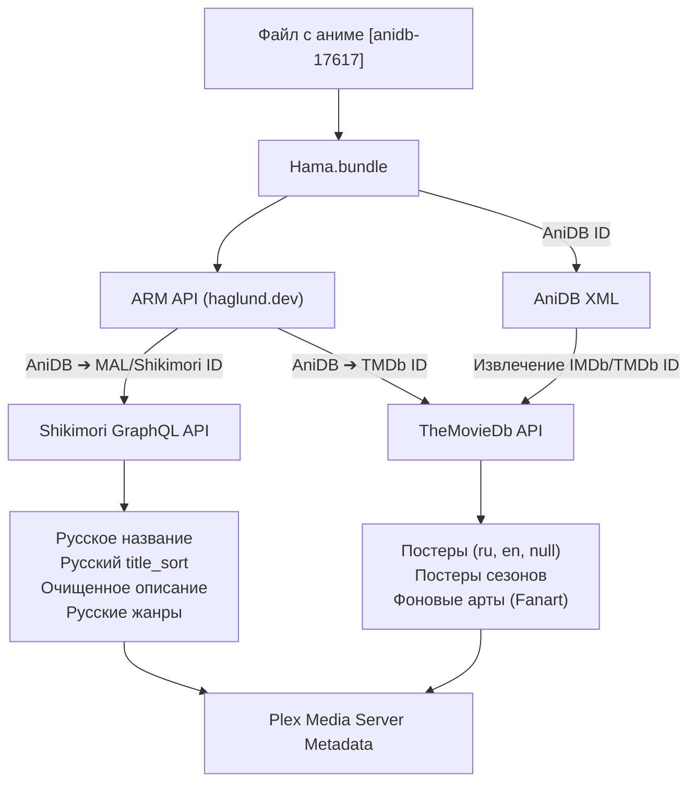

# Shikimori-Hama.bundle

<p align="center">
  
</p>

<p align="center">
  <strong>Современный агент метаданных для Plex Media Server, ориентированный на русскоязычное аниме-сообщество Shikimori.</strong>
</p>

<p align="center">
  <a href="README_EN.md">English</a> • <strong>Русский</strong>
</p>

<p align="center">
  
  
  
  
  
  
</p>

---

> [!NOTE]
> **Дисклеймер о разработке:**  
> Изменения, новые модули (`Shikimori.py`) и адаптация исходного кода данного форка разработаны и оптимизированы с использованием **искусственного интеллекта (ИИ)** в связке с тестированием в среде Plex Media Server.

---

Этот проект является глубоко переработанным форком популярного агента [Hama.bundle](https://github.com/ZeroQI/Hama.bundle) от **ZeroQI**.

Главная цель форка — предоставить русскоязычным пользователям Plex максимально точные, актуальные и качественные метаданные (названия, описания, жанры, постеры и фоны) из базы **Shikimori** через современный **GraphQL API**, совмещая это с мощной системой постеров **TheMovieDb (TMDb)** и обновленным поиском **TheTVDB API v4**.

---

## 📑 Содержание

- [🚀 Основные возможности](#-основные-возможности)
- [📁 Различия с оригинальным Hama.bundle](#-различия-с-оригинальным-hamabundle)
  - [Сводная таблица отличий](#сводная-таблица-отличий)
  - [Подробный разбор изменений](#подробный-разбор-изменений)
- [🔧 Установка](#-установка)
- [📂 Именование файлов и папок](#-именование-файлов-и-папок)
- [⚙️ Настройка плагина в Plex](#️-настройка-плагина-в-plex)
  - [Приоритеты источников метаданных](#приоритеты-источников-метаданных)
  - [Настройки TheMovieDb (Постеры и Арт)](#настройки-themoviedb-постеры-и-арт)
  - [Настройки TheTVDB (API v4)](#настройки-thetvdb-api-v4)
- [🔍 Принцип работы агента](#-принцип-работы-агента)
- [🤖 Интеграция с ботом-синхронизатором](#-интеграция-с-ботом-синхронизатором)
- [⚠️ Дисклеймер](#️-дисклеймер)
- [📜 Лицензия и благодарности](#-лицензия-и-благодарности)

---

## 🚀 Основные возможности

- ✨ **Официальный GraphQL API Shikimori**  
  Полная интеграция с `https://shikimori.io/api/graphql`. Больше никаких нестабильных HTML-парсеров и парсинга страниц: данные загружаются быстро, надежно и в чистом JSON-формате.

- 🇷🇺 **Приоритет русскоязычных метаданных «из коробки»**  
  - Русские официальные названия тайтлов.
  - Умная сортировка (`title_sort`) с корректной обработкой кириллицы.
  - Чистые описания без BBCode-тегов, вики-ссылок `[[...]]`, служебного мусора и HTML.
  - Локализованные русские жанры.

- 🔗 **Умный маппинг через ARM API и AniDB**  
  Автоматическое сопоставление `AniDB ID` ➔ `Shikimori ID (MAL ID)` и `AniDB ID` ➔ `TMDb ID` через [Anime Relations Map (ARM API)](https://arm.haglund.dev/), а также извлечение прямых связей IMDb и TMDb из XML-базы AniDB.

- 🖼️ **Продвинутая система постеров и артов TheMovieDb (TMDb)**  
  - Фильтрация постеров по языкам (`ru`, `en`, `ja`, `null` и др.).
  - Механизм **Cache Buster** для получения самых свежих постеров в обход серверного кэша TMDb.
  - Поддержка **постеров для отдельных сезонов** сериалов.
  - Опция принудительного приоритета сезонного постера над сериальным (`prioritize_season_poster`).
  - Умная сортировка артов по приоритету языка, физическому разрешению (ширина × высота) и рейтингу зрителей.

- ⚡ **Актуальный поиск TheTVDB API v4**  
  Полная поддержка нового TheTVDB API v4 с авторизацией по токену и поддержкой ISO 639-2 языковых кодов взамен устаревшего и отключенного XML-поиска TheTVDB v1/v2.

---

## 📁 Различия с оригинальным Hama.bundle

Форк содержит как совершенно новые модули, так и глубокие архитектурные доработки существующих компонентов оригинального Hama.

### Сводная таблица отличий

| Компонент / Возможность | Оригинал (`Hama.bundle`) | Этот форк (`Shikimori-Hama.bundle`) | Преимущество форка |
| :--- | :--- | :--- | :--- |
| **Источник Shikimori** | ❌ Отсутствует | ✅ Новый модуль `Shikimori.py` на базе **GraphQL API** | Чистые русские названия, описания и жанры без парсинга сайтов |
| **Очистка описаний** | ❌ Базовая или отсутствует | ✅ Глубокий рекурсивный парсер BB-тегов, wiki-ссылок и slug-имён | Описания в Plex выглядят опрятно и читаемо, без остатков разметки |
| **Модуль `TheMovieDb.py`** | Базовая версия (148 строк, устаревшие endpoint'ы) | Глубоко переработанная версия (256 строк) | Поддержка сериалов, аниме-фильмов, сезонов, мультиязычности |
| **Связывание ID (ARM API)** | ❌ Не используется | ✅ Автоматический поиск TMDb и Shikimori ID по AniDB ID | Точное сопоставление аниме между базами без ручного ввода |
| **Извлечение ID из AniDB XML** | Только ANN ID | ✅ Извлечение **IMDb ID** (тип 43) и **TMDb ID** (тип 44) | Больше связей для поиска постеров и рейтингов без доп. запросов |
| **TMDb: Мультиязычные постеры** | ❌ Только стандартные постеры | ✅ Параметр `include_image_language` + настройка `TMDbPosterLanguages` | Возможность гибко выбирать постеры на русском, английском, японском или без текста |
| **TMDb: Обход кэша (Cache Buster)** | ❌ Нет | ✅ Добавление временного штампа к запросам языков | Быстрое получение только что загруженных на TMDb постеров |
| **TMDb: Сезонные постеры** | ❌ Нет загрузки постеров сезонов | ✅ Запрос `/season/{number}/images` + маппинг сезонов | Красивые индивидуальные постеры для каждого сезона аниме |
| **TMDb: Приоритет постера сезона** | ❌ Нет | ✅ Опция `prioritize_season_poster` | Для 1-сезонных тайтлов постер сезона может назначаться постером всего шоу |
| **Сортировка изображений TMDb** | Простая (по рангу источника) | ✅ Многокритериальная: `Язык ➔ Разрешение ➔ Рейтинг TMDb` | В библиотеку всегда попадает арт максимального качества и нужного языка |
| **Поиск TheTVDB (`TheTVDBv2.py`)** | ⚠️ Старый XML-поиск (часто отдаёт 403 / не работает) | ✅ Современный **TheTVDB API v4 Search** (`/v4/search`) | Стабильный поиск сериалов с авторизацией по JWT-токену |
| **Настройки по умолчанию (`DefaultPrefs.json`)** | Заточены под английский язык (AniDB / TheTVDB) | ✅ Оптимизированы под русский язык (Shikimori в топе всех текстовых полей) | Не требует долгой ручной настройки после установки |
| **Исправление регистра файлов** | `com.plexapp.agents.hama.xml` | ✅ `com.plexapp.agents.Hama.xml` | Корректная работа с регистрозависимыми файловыми системами (Linux/Docker) |

---

### Подробный разбор изменений

#### 1. Модуль `Shikimori.py` (Новый источник метаданных)
- Реализован как полноценный независимый источник метаданных в ядре агента (`__init__.py`, `common.py`).
- Отправляет оптимизированные POST-запросы к GraphQL-эндпоинту `https://shikimori.io/api/graphql`:
  ```graphql
  query getAnimeData($id: String!) {
    animes(ids: $id) {
      id
      russian
      description
      genres {
        russian
      }
    }
  }
  ```
- **Продвинутый алгоритм очистки синопсиса:**
  - Преобразует wiki-ссылки `[[Персонаж]]` ➔ `Персонаж`.
  - Рекурсивно раскрывает парные теги с параметрами `[character=123 slug]Имя[/character]` ➔ `Имя`.
  - Форматирует одиночные теги со slug: `[character=123 yuken-emma]` ➔ `Yuken Emma`.
  - Удаляет любые оставшиеся HTML/BB-теги и лишние пробелы.
- Автоматически формирует правильное русское название для сортировки (`title_sort`) и выставляет наивысший приоритет языка (`language_rank = -1`).

#### 2. Модуль `TheMovieDb.py` (Глубокая модернизация)
- **Интеграция с ARM API:** при наличии только `AniDB ID` агент делает запрос к `https://arm.haglund.dev/api/v2/ids?source=anidb&include=themoviedb&id={AniDB_ID}` и получает точный `themoviedb_id`.
- **Гибкий выбор языков постеров:** настройка `TMDbPosterLanguages` передает список языков через параметр `include_image_language=ru,en,null,<timestamp>`, принудительно обновляя список постеров через Cache Buster.
- **Индивидуальные постеры сезонов:** загружаются из `/tv/{id}/season/{season_number}/images` и сохраняются в структуре `TheMovieDb_dict['seasons'][season_num]['posters']`. При включенной опции `prioritize_season_poster` постер единственного сезона получает бонус к рангу (`priority_boost = 20`) и становится основным постером сериала.
- **Алгоритм ранжирования изображений:**
  $$\text{Score} = (\text{Priority}_{\text{lang}}, -\text{Width} \times \text{Height}, -\text{Rating})$$
  Постеры с одинаковым приоритетом языка сортируются по разрешению (чем выше разрешение, тем выше постер) и оценке пользователей TMDb.

#### 3. Модуль `TheTVDBv2.py` (TheTVDB API v4)
- Оригинальный Hama использовал устаревший XML API TheTVDB (`GetSeries.php`), который больше не поддерживается и приводит к ошибкам.
- Добавлена функция `EnsureTVDB4Token()`, запрашивающая и кэширующая JWT-токен TheTVDB API v4 с использованием ключа `Tvdb4ApiKey`.
- Поиск переведен на `/v4/search?query=...&type=series` с конвертацией языковых кодов ISO 639-1 (`ru`, `en`, `ja`) в ISO 639-2 (`rus`, `eng`, `jpn`) через таблицу `ISO639_2`.
- Поддерживается каскадный поиск с запасными вариантами (с указанием года / без года / с удалением года из названия) и подсчет схожести названий и алиасов по расстоянию Левенштейна.

#### 4. Модуль `AniDB.py` (Расширенные внешние связи)
- Добавлен парсинг узлов XML-ответа AniDB:
  - `<resource type="43">` ➔ `IMDb ID`
  - `<resource type="44">` ➔ `TMDb ID`
- Найденные ID немедленно пробрасываются в конвейер метаданных, благодаря чему TheMovieDb и OMDb могут работать даже без предварительного сопоставления.

---

## 🔧 Установка

1. **Скачайте репозиторий:**
   - Нажмите зеленую кнопку **Code** ➔ **Download ZIP** или клонируйте репозиторий:
     ```bash
     git clone https://github.com/qipparu/Shikimori-Hama-dev.bundle.git
     ```
2. **Переименуйте папку:**
   - Переименуйте папку в `Hama.bundle` (или `Shikimori-Hama.bundle`).
3. **Скопируйте в директорию плагинов Plex:**
   - **Windows:**
     `%LOCALAPPDATA%\Plex Media Server\Plug-ins`  
     *(обычно: `C:\Users\<Имя_Пользователя>\AppData\Local\Plex Media Server\Plug-ins`)*
   - **Linux / Docker:**
     `/var/lib/plexmediaserver/Library/Application Support/Plex Media Server/Plug-ins`  
     *(в Docker проверьте примонтированный путь конфигурации)*
   - **macOS:**
     `~/Library/Application Support/Plex Media Server/Plug-ins`
   - **Synology NAS:**
     `/volume1/Plex/Library/Application Support/Plex Media Server/Plug-ins`
4. **Перезапустите Plex Media Server.**

---

## 📂 Именование файлов и папок

Для максимально точного и быстрого сопоставления рекомендуется указывать идентификаторы баз в названии папки сериала или фильма:

### Формат с AniDB ID (Рекомендуется)
```text
Anime/
 └── Sousou no Frieren [anidb-17617]/
      ├── Sousou no Frieren - S01E01.mkv
      ├── Sousou no Frieren - S01E02.mkv
      └── ...
```
> [!TIP]
> Поддерживаются как квадратные скобки `[anidb-17617]`, так и фигурные `{anidb-17617}`. Агент автоматически найдет соответствия на **Shikimori**, **TMDb** и **TheTVDB** через ARM API.

### Другие поддерживаемые форматы
- **По TheTVDB ID:** `Serial Name [tvdb-415810]`
- **По TheMovieDb ID:** `Movie Name [tmdb-103728]`
- **По MyAnimeList ID:** `Anime Name [mal-52991]`

---

## ⚙️ Настройка плагина в Plex

После установки агента откройте Plex:
1. Перейдите в **Настройки ➔ Библиотеки** (или нажмите `...` рядом с вашей Аниме-библиотекой ➔ **Управление библиотекой** ➔ **Редактировать**).
2. Во вкладке **Дополнительно (Advanced)** выберите:
   - **Агент (Agent):** `Hama.bundle`
   - **Сканер (Scanner):** `Plex Series Scanner` (или `Absolute Series Scanner` при наличии).

---

### Приоритеты источников метаданных

В настройках агента вы можете настроить порядок источников для каждого поля метаданных. По умолчанию уже выставлены оптимальные параметры:

| Поле в настройках | Значение по умолчанию | Описание |
| :--- | :--- | :--- |
| **`title`** | `Shikimori, AniDB, TheTVDB \| TheTVDB, AniDB` | Основное название тайтла (приоритет у Shikimori) |
| **`title_sort`** | `Shikimori, AniDB, TheTVDB` | Название для сортировки в библиотеке |
| **`summary`** | `Shikimori, TheTVDB, AniDB` | Описание аниме |
| **`genres`** | `Shikimori, TheTVDB, AniDB, MyAnimeList, TheMovieDb, OMDb` | Список жанров |
| **`posters`** | `tvdb4, TheMovieDb, TheTVDB, AniList, FanartTV, AniDB` | Источники постеров |
| **`art`** | `TheTVDB, TheMovieDb, FanartTV` | Источники фоновых изображений (Fanart) |

> [!NOTE]
> Символ `|` разделяет приоритеты для Сериалов (слева) и Эпизодов (справа).

---

### Настройки TheMovieDb (Постеры и Арт)

| Параметр | По умолчанию | Описание |
| :--- | :--- | :--- |
| **`TMDbPosterLanguages`** | `all` | Языки для загрузки постеров (через запятую, без пробелов). Например: `ru,en,null`. `null` — постеры без текста (текстовые заглушки). `all` — загрузка всех языков без фильтрации. |
| **`PosterLanguagePriority`** | `en` *(рекомендуется `ru,en,null`)* | Порядок приоритета языков при сортировке найденных постеров. Постеры с языком, идущим раньше в списке, будут отображаться первыми. |
| **`force_tmdb_poster_refresh`** | `false` | Если включено (`true`), отключает локальный недельный кэш списка постеров для загрузки самых свежих изображений с TMDb API. |
| **`prioritize_season_poster`** | `false` | Если включено (`true`), для односезонных аниме постер сезона получит повышенный приоритет и станет главным постером сериала. |

#### Примеры настройки `TMDbPosterLanguages`:
- `ru,en,null` — загрузить русские, затем английские и постеры без надписей.
- `ru,ja,null` — загрузить русские, японские оригинальные и текстовые арты.
- `ru,null` — только русские и нейтральные арты.
- `all` — загрузить абсолютно все постеры на любых языках.

---

### Настройки TheTVDB (API v4)

> [!IMPORTANT]
> **Для работы поиска сериалов через TheTVDB необходим API-ключ!**  
> Новый TheTVDB API v4 требует обязательной авторизации через Bearer-токен. Для использования поиска TheTVDB укажите ваш ключ в настройке `Tvdb4ApiKey`. Без ключа запросы к поиску TheTVDB v4 выполняться не будут.

| Параметр | Описание |
| :--- | :--- |
| **`Tvdb4ApiKey`** | **Обязателен для поиска TheTVDB.** Персональный API Key для TheTVDB v4, используемый для авторизации и генерации JWT Bearer-токена. |

---

## 🔍 Принцип работы агента



1. **Определение ID:** Агент считывает `AniDB ID` из названия папки или файла.
2. **Запрос к ARM API:** Находит соответствующие `Shikimori ID` и `TMDb ID`.
3. **Получение текста (Shikimori):** Отправляет GraphQL-запрос к Shikimori, получает чистое русское название, очищает описание от BBCode и wiki-тегов, извлекает русские жанры.
4. **Получение графики (TMDb):** Запрашивает постеры и арт с фильтрацией языков, обходом кэша и поддержкой сезонных изображений.
5. **Сборка метаданных:** Объединяет все данные по заданной в настройках шкале приоритетов и передает в Plex.

---

## 🤖 Интеграция с ботом-синхронизатором

Плагин полностью совместим с инфраструктурой синхронизации просмотров между Plex и личным профилем на Shikimori через вебхуки Plex и Telegram-бота. 

Благодаря использованию единых идентификаторов Shikimori отметки о просмотренных сериях в Plex автоматически и безошибочно транслируются в список просмотренного на Shikimori.

---

## ⚠️ Дисклеймер

- Исходный код модификаций, новые модули интеграции со сторонними API и документация подготовлены при содействии **искусственного интеллекта (ИИ)**.
- Плагин предоставляется по принципу **«как есть» (AS IS)** без каких-либо гарантий. Перед массовым обновлением метаданных рекомендуется протестировать работу на отдельной тестовой библиотеке Plex.

---

## 📜 Лицензия и благодарности

- Основано на оригинальном коде **[Hama.bundle](https://github.com/ZeroQI/Hama.bundle)** от **ZeroQI**.
- Проект распространяется под свободной лицензией **GNU General Public License v3.0 (GPL-3.0)** в соответствии с оригинальным проектом.
- Выражаем благодарность сообществам **Shikimori**, **AniDB**, **TheMovieDb**, **TheTVDB** и разработчикам **ARM API**.
