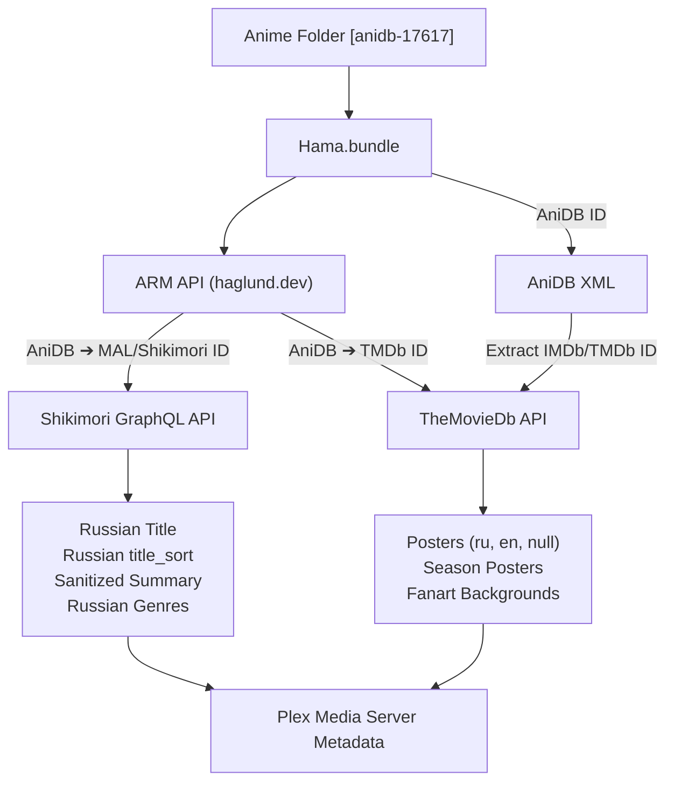

# Shikimori-Hama.bundle

<p align="center">
  
</p>

<p align="center">
  <strong>Modern anime metadata agent for Plex Media Server powered by Shikimori, TheMovieDb, and TheTVDB v4.</strong>
</p>

<p align="center">
  <strong>English</strong> • <a href="README.md">Русский</a>
</p>

<p align="center">
  
  
  
  
  
  
</p>

---

> [!NOTE]
> **Development Disclaimer:**  
> The modifications, new modules (`Shikimori.py`), and architectural improvements in this fork were developed and optimized with the assistance of **Artificial Intelligence (AI)** and validated against the Plex Media Server agent environment.

---

This project is an enhanced fork of the popular [Hama.bundle](https://github.com/ZeroQI/Hama.bundle) metadata agent by **ZeroQI**.

The primary objective of this fork is to provide rich, accurate, and up-to-date metadata from **Shikimori** via its modern **GraphQL API**, combined with an advanced **TheMovieDb (TMDb)** poster pipeline and modernized **TheTVDB API v4** search.

---

## 📑 Table of Contents

- [🚀 Key Features](#-key-features)
- [📁 Differences from Original Hama.bundle](#-differences-from-original-hamabundle)
  - [Comparison Table](#comparison-table)
  - [Detailed Breakdown of Changes](#detailed-breakdown-of-changes)
- [🔧 Installation](#-installation)
- [📂 File and Folder Naming](#-file-and-folder-naming)
- [⚙️ Plugin Configuration in Plex](#️-plugin-configuration-in-plex)
  - [Metadata Source Priorities](#metadata-source-priorities)
  - [TheMovieDb Settings (Posters & Artwork)](#themoviedb-settings-posters--artwork)
  - [TheTVDB Settings (API v4)](#thetvdb-settings-api-v4)
- [🔍 How the Agent Works](#-how-the-agent-works)
- [🤖 Scrobbler & Bot Integration](#-scrobbler--bot-integration)
- [⚠️ Disclaimer](#️-disclaimer)
- [📜 License & Credits](#-license--credits)

---

## 🚀 Key Features

- ✨ **Official Shikimori GraphQL API Integration**  
  Direct communication with `https://shikimori.io/api/graphql`. Eliminates fragile HTML web scrapers in favor of fast, reliable, structured JSON data.

- 🇷🇺 **Russian Metadata Priority Out of the Box**  
  - Localized official Russian anime titles.
  - Smart sorting titles (`title_sort`) with proper Cyrillic alphabet normalization.
  - Sanitized summaries stripped of BBCode tags, wiki links `[[...]]`, slug wrappers, and HTML artifacts.
  - Localized Russian genres.

- 🔗 **Intelligent ID Mapping via ARM API & AniDB**  
  Automatic translation of `AniDB ID` ➔ `Shikimori ID (MAL ID)` and `AniDB ID` ➔ `TMDb ID` using the [Anime Relations Map (ARM API)](https://arm.haglund.dev/), alongside direct IMDb & TMDb external relation extraction from AniDB XML.

- 🖼️ **Advanced TheMovieDb (TMDb) Poster & Fanart Engine**  
  - Multi-language image querying (`ru`, `en`, `ja`, `null`, etc.).
  - **Cache Buster** mechanism to bypass TMDb API caching and retrieve newly uploaded posters instantly.
  - Full support for **individual Season Posters**.
  - Single-season anime poster promotion option (`prioritize_season_poster`).
  - Multi-criteria image ranking: language priority ➔ resolution (width × height) ➔ TMDb community rating.

- ⚡ **TheTVDB API v4 Search Integration**  
  Replaces deprecated and broken XML search endpoints with modern TheTVDB API v4 search (`/v4/search`) featuring Bearer token authentication and ISO 639-2 language code mapping.

---

## 📁 Differences from Original Hama.bundle

This fork introduces completely new modules as well as deep architectural refactoring of existing Hama components.

### Comparison Table

| Feature / Component | Original (`Hama.bundle`) | This Fork (`Shikimori-Hama.bundle`) | Advantage of Fork |
| :--- | :--- | :--- | :--- |
| **Shikimori Provider** | ❌ None | ✅ New `Shikimori.py` module using **GraphQL API** | Clean, official Russian titles, synopses, and genres without HTML scraping |
| **Synopsis Sanitization** | ❌ Minimal / None | ✅ Deep recursive regex parser for BBCode, wiki links, and slugs | Clean, legible summaries in Plex without broken tags or raw markup |
| **`TheMovieDb.py` Module** | Basic version (148 lines, legacy endpoints) | Deeply overhauled (256 lines) | Robust TV series, movies, season posters, and multi-language support |
| **ARM API ID Resolution** | ❌ Not used | ✅ Auto-lookup of TMDb & Shikimori IDs via AniDB ID | Accurate cross-database matching without manual tagging |
| **AniDB XML External IDs** | Only ANN ID extracted | ✅ Extracts **IMDb ID** (type 43) and **TMDb ID** (type 44) | Enriches relations for posters and ratings without extra requests |
| **TMDb: Multi-Language Posters** | ❌ Default posters only | ✅ `include_image_language` parameter + `TMDbPosterLanguages` setting | Flexible selection of Russian, English, Japanese, or textless artwork |
| **TMDb: Cache Buster** | ❌ None | ✅ Dynamic timestamp parameter added to language requests | Instantly pulls newly uploaded posters from TMDb |
| **TMDb: Season Posters** | ❌ No season poster fetching | ✅ Queries `/season/{number}/images` with season mapping | Beautiful dedicated posters for every anime season |
| **TMDb: Season Poster Priority** | ❌ None | ✅ `prioritize_season_poster` setting | For 1-season shows, season poster can override generic series poster |
| **TMDb Image Ranking** | Basic source rank only | ✅ Multi-criteria: `Language ➔ Resolution ➔ Community Rating` | Always picks highest resolution art in preferred language |
| **TheTVDB Search (`TheTVDBv2.py`)**| ⚠️ Defunct XML search (`GetSeries.php`, HTTP 403) | ✅ Modern **TheTVDB API v4 Search** (`/v4/search`) | Reliable series matching with JWT Bearer token authentication |
| **Default Settings (`DefaultPrefs.json`)**| Tuned for English (AniDB / TheTVDB) | ✅ Optimized for Russian anime library (Shikimori at top priority) | Ready to use immediately after installation without manual tweaking |
| **Case Sensitivity Fix** | `com.plexapp.agents.hama.xml` | ✅ `com.plexapp.agents.Hama.xml` | Seamless operation on case-sensitive filesystems (Linux / Docker) |

---

### Detailed Breakdown of Changes

#### 1. Module `Shikimori.py` (New Metadata Source)
- Integrated as a first-class independent metadata source within the agent core (`__init__.py`, `common.py`).
- Sends optimized POST requests to the GraphQL endpoint `https://shikimori.io/api/graphql`:
  ```graphql
  query getAnimeData($id: String!) {
    animes(ids: $id) {
      id
      russian
      description
      genres {
        russian
      }
    }
  }
  ```
- **Advanced synopsis cleanup engine:**
  - Converts wiki links `[[Character]]` ➔ `Character`.
  - Recursively expands paired tags with arguments: `[character=123 slug]Name[/character]` ➔ `Name`.
  - Formats standalone slug tags: `[character=123 yuken-emma]` ➔ `Yuken Emma`.
  - Strips remaining HTML/BBCode tags and normalizes excessive whitespace.
- Automatically computes Russian sort title (`title_sort`) and assigns top language ranking priority (`language_rank = -1`).

#### 2. Module `TheMovieDb.py` (Deep Overhaul)
- **ARM API Integration:** when only `AniDB ID` is present, the agent queries `https://arm.haglund.dev/api/v2/ids?source=anidb&include=themoviedb&id={AniDB_ID}` to obtain the exact `themoviedb_id`.
- **Flexible Poster Language Selection:** `TMDbPosterLanguages` sends `include_image_language=ru,en,null,<timestamp>`, bypassing TMDb cache via dynamic Cache Buster.
- **Dedicated Season Posters:** fetched from `/tv/{id}/season/{season_number}/images` and organized under `TheMovieDb_dict['seasons'][season_num]['posters']`. When `prioritize_season_poster` is enabled, single-season anime receive a rank boost (`priority_boost = 20`) to serve as the series poster.
- **Image Ranking Formula:**
  $$\text{Score} = (\text{Priority}_{\text{lang}}, -\text{Width} \times \text{Height}, -\text{Rating})$$
  Posters of matching language priority are sorted by resolution (higher is better) and community rating.

#### 3. Module `TheTVDBv2.py` (TheTVDB API v4)
- Replaces defunct XML search endpoints with modern TheTVDB API v4 search.
- Includes `EnsureTVDB4Token()` to acquire and refresh Bearer JWT tokens using `Tvdb4ApiKey`.
- Maps ISO 639-1 language codes (`ru`, `en`, `ja`) to ISO 639-2 (`rus`, `eng`, `jpn`) via lookup dictionary `ISO639_2`.
- Performs cascade searches (with year / without year / title normalization) and computes similarity scores using Levenshtein distance against titles and aliases.

#### 4. Module `AniDB.py` (Enhanced External IDs)
- Extracts additional external database identifiers from AniDB XML:
  - `<resource type="43">` ➔ `IMDb ID`
  - `<resource type="44">` ➔ `TMDb ID`
- Propagates these IDs across the pipeline so TheMovieDb and OMDb work without manual ID mapping.

---

## 🔧 Installation

1. **Download the repository:**
   - Click the green **Code** button ➔ **Download ZIP**, or clone via git:
     ```bash
     git clone https://github.com/qipparu/Shikimori-Hama-dev.bundle.git
     ```
2. **Rename the folder:**
   - Rename the folder to `Hama.bundle` (or `Shikimori-Hama.bundle`).
3. **Copy to your Plex Plug-ins directory:**
   - **Windows:**
     `%LOCALAPPDATA%\Plex Media Server\Plug-ins`  
     *(typically: `C:\Users\<Username>\AppData\Local\Plex Media Server\Plug-ins`)*
   - **Linux / Docker:**
     `/var/lib/plexmediaserver/Library/Application Support/Plex Media Server/Plug-ins`  
     *(in Docker, check your mounted config path)*
   - **macOS:**
     `~/Library/Application Support/Plex Media Server/Plug-ins`
   - **Synology NAS:**
     `/volume1/Plex/Library/Application Support/Plex Media Server/Plug-ins`
4. **Restart Plex Media Server.**

---

## 📂 File and Folder Naming

For fast and 100% accurate matching, include database IDs in your series folder names:

### AniDB ID Format (Recommended)
```text
Anime/
 └── Sousou no Frieren [anidb-17617]/
      ├── Sousou no Frieren - S01E01.mkv
      ├── Sousou no Frieren - S01E02.mkv
      └── ...
```
> [!TIP]
> Both square brackets `[anidb-17617]` and curly braces `{anidb-17617}` are supported. The agent automatically resolves **Shikimori**, **TMDb**, and **TheTVDB** matches via ARM API.

### Other Supported Formats
- **TheTVDB ID:** `Series Name [tvdb-415810]`
- **TheMovieDb ID:** `Movie Name [tmdb-103728]`
- **MyAnimeList ID:** `Anime Name [mal-52991]`

---

## ⚙️ Plugin Configuration in Plex

To configure the agent in Plex:
1. Open **Settings ➔ Libraries** (or click `...` next to your Anime library ➔ **Manage Library** ➔ **Edit**).
2. Under the **Advanced** tab, set:
   - **Agent:** `Hama.bundle`
   - **Scanner:** `Plex Series Scanner` (or `Absolute Series Scanner` if installed).

---

### Metadata Source Priorities

You can customize the priority order for each metadata field. Default settings are pre-configured for optimal Russian anime metadata:

| Setting | Default Value | Description |
| :--- | :--- | :--- |
| **`title`** | `Shikimori, AniDB, TheTVDB \| TheTVDB, AniDB` | Main title (Shikimori has highest priority) |
| **`title_sort`** | `Shikimori, AniDB, TheTVDB` | Library sort title |
| **`summary`** | `Shikimori, TheTVDB, AniDB` | Synopsis / description |
| **`genres`** | `Shikimori, TheTVDB, AniDB, MyAnimeList, TheMovieDb, OMDb` | Genre list |
| **`posters`** | `tvdb4, TheMovieDb, TheTVDB, AniList, FanartTV, AniDB` | Poster sources |
| **`art`** | `TheTVDB, TheMovieDb, FanartTV` | Fanart (background) sources |

> [!NOTE]
> The `|` separator designates Series priority (left) and Episode priority (right).

---

### TheMovieDb Settings (Posters & Artwork)

| Setting | Default Value | Description |
| :--- | :--- | :--- |
| **`TMDbPosterLanguages`** | `all` | Comma-separated list of image languages (no spaces), e.g. `ru,en,null`. `null` represents textless artwork. `all` fetches all available languages. |
| **`PosterLanguagePriority`** | `en` *(recommended `ru,en,null`)* | Language ordering for poster ranking. Posters matching earlier languages appear first in the selection list. |
| **`force_tmdb_poster_refresh`** | `false` | When enabled (`true`), disables local 1-week poster caching to fetch the newest uploads from TMDb API. |
| **`prioritize_season_poster`** | `false` | When enabled (`true`), promotes the season poster to serve as the series poster for single-season anime. |

#### Examples of `TMDbPosterLanguages`:
- `ru,en,null` — fetch Russian, then English, and textless posters.
- `ru,ja,null` — fetch Russian, Japanese original, and textless posters.
- `ru,null` — fetch only Russian and textless posters.
- `all` — fetch all posters across all languages.

---

### TheTVDB Settings (API v4)

> [!IMPORTANT]
> **An API Key is required for TheTVDB Search to function!**  
> TheTVDB API v4 requires a valid Bearer JWT token. To enable TheTVDB search, enter your personal API key in `Tvdb4ApiKey`. Without this key, TheTVDB search queries will not execute.

| Setting | Description |
| :--- | :--- |
| **`Tvdb4ApiKey`** | **Required for TheTVDB search.** Personal API Key for TheTVDB v4 used for authentication and token generation. |

---

## 🔍 How the Agent Works



1. **ID Extraction:** The agent reads the `AniDB ID` from the folder or file name.
2. **ARM API Lookup:** Resolves corresponding `Shikimori ID` and `TMDb ID`.
3. **Metadata Fetching (Shikimori):** Executes a GraphQL query against Shikimori, retrieving localized title, cleaned synopsis, and genre tags.
4. **Artwork Fetching (TMDb):** Queries multi-language posters and fanart with Cache Buster and season support.
5. **Assembly:** Merges and applies all metadata fields to Plex based on configured priority rankings.

---

## 🤖 Scrobbler & Bot Integration

This agent is fully compatible with Plex-to-Shikimori scrobbling tools and Telegram bots. By using standardized Shikimori identifiers, watched episodes in Plex automatically synchronize with your Shikimori profile.

---

## ⚠️ Disclaimer

- Source code modifications, new third-party API integration modules, and documentation were created with the assistance of **Artificial Intelligence (AI)**.
- This plugin is provided **"AS IS"** without warranties of any kind. It is recommended to test on a small sample library before applying to your entire collection.

---

## 📜 License & Credits

- Based on **[Hama.bundle](https://github.com/ZeroQI/Hama.bundle)** by **ZeroQI**.
- Distributed under the **GNU General Public License v3.0 (GPL-3.0)** in accordance with the original project.
- Special thanks to the communities of **Shikimori**, **AniDB**, **TheMovieDb**, **TheTVDB**, and the maintainers of **ARM API**.
